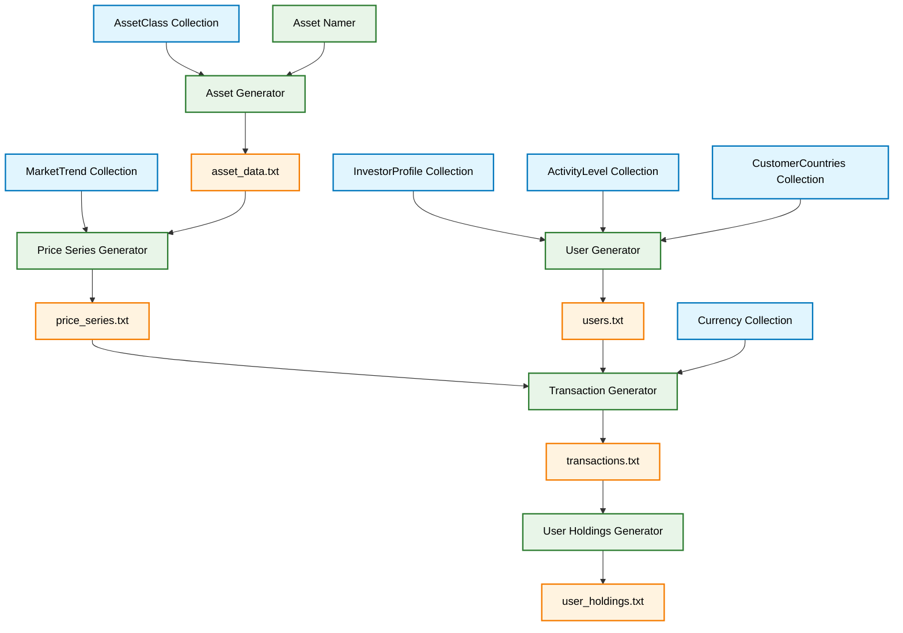

# Architecture

## Pattern
Feature-based modular monolith with domain-driven design principles.

## Core Components

### Data Generators
- **IDataGenerator**: Interface for all data generation logic
- **IDataSaver**: Interface for file output operations  
- **DataGenerationService**: Orchestrates generate-and-save workflow

### Key Generators
- **AssetGenerator**: Creates investment assets with asset classes and names
- **PriceSeriesGenerator**: Generates historical price data using market trends
- **UserGenerator**: Creates investor profiles with risk tolerance and activity levels
- **TransactionGenerator**: Simulates buy/sell transactions based on user profiles
- **UserHoldingsGenerator**: Calculates final portfolios from transactions

### Orchestration
- **WiseCrowdDataOrchestrator**: Main entry point, coordinates all generators
- **DataGenerationConfig**: Configuration for assets, users, dates
- **IOutputDirectory**: File output location management

## Data Flow
1. **Config** → DataGenerationConfig with parameters
2. **Assets** → AssetGenerator creates investment assets
3. **Prices** → PriceSeriesGenerator creates historical data
4. **Users** → UserGenerator creates investor profiles
5. **Transactions** → TransactionGenerator simulates trading
6. **Holdings** → UserHoldingsGenerator calculates final portfolios

## System Architecture Diagram

## Error Handling
Centralized error handling with detailed exception messages and validation at generator boundaries.

## Logging
- **ILog**: Interface for progress tracking
- Step-by-step progress reporting during generation
- File creation confirmation and statistics