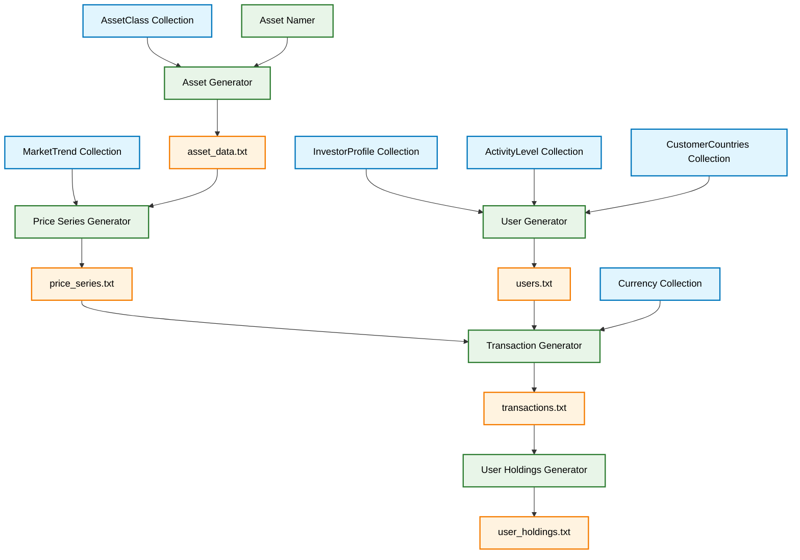

# WiseCrowd Data Generator Design

## System Architecture Diagram

## Swedish/Nordic Market Trend Dataset (1990-2025)

| Start Date | End Date  | Trend Type  | Strength | Description               |
|------------|-----------|-------------|----------|---------------------------|
| 1990-01-01 | 1992-11-01| Bear        | 1.8      | Nordic banking crisis     |
| 1992-11-21 | 1995-01-05| Recovery    | 1.3      | Post-crisis restructuring |
| 1995-01-06 | 1997-08-19| Bull        | 1.4      | EU membership boost       |
| 1997-08-19 | 1999-10-11| Correction  | -0.7     | Asian financial crisis impact |
| 1998-10-11 | 2000-03-10| Bull        | 1.8      | Dot-com boom             |
| 2000-03-11 | 2002-10-10| Bear        | 1.7      | Tech bubble burst        |
| 2002-10-10 | 2007-07-17| Bull        | 1.5      | Global expansion         |
| 2007-07-17 | 2009-03-09| Bear        | -2.3     | Financial crisis         |
| 2009-03-10 | 2011-07-21| Bull        | 1.6      | Recovery phase           |
| 2011-07-22 | 2012-05-04| Correction  | -0.8     | Eurozone debt crisis     |
| 2012-06-05 | 2015-04-15| Bull        | 1.3      | QE-driven growth         |
| 2015-04-16 | 2016-02-11| Correction  | -0.6     | China slowdown fears     |
| 2016-02-12 | 2018-01-26| Bull        | 1.4      | Synchronized global growth|
| 2018-01-27 | 2018-12-24| Correction  | -0.7     | Trade war concerns       |
| 2018-12-25 | 2020-02-19| Bull        | 1.2      | Late-cycle growth        |
| 2020-02-20 | 2020-03-23| Crash       | -2.1     | COVID-19 pandemic        |
| 2020-03-24 | 2021-11-08| Bull        | 1.7      | Stimulus recovery        |
| 2021-11-09 | 2022-09-30| Bear        | -1.5     | Inflationary fears       |
| 2022-10-01 | 2023-07-31| Recovery    | 1.2      | Disinflation hopes       |
| 2023-08-01 | 2024-03-25| Sideways    | 0.2      | Soft landing uncertainty  |
| 2024-03-26 | 2025-06-??| Bull        | 1.1      | Current phase            |

## Asset Classes

| ID | Name | Description | Volatility Level | Prevalence (%) |
|----|------|-------------|------------------|----------------|
| 1  | Nordic stocks | Public company shares from Nordic high-growth markets | Very High | 33 |
| 2  | Government bond | Fixed income security issued by sovereign governments | Low | 21 |
| 3  | Corporate Bond | Fixed income security issued by private companies | Low-Medium | 13 |
| 4  | Medium-Risk Fund | Diversified fund with both stocks and bonds | Medium | 20 |
| 5  | Large-Cap Equity | Shares in large to established foreign companies | Medium-High | 25 |
| 6  | Gold / Precious Metals | Physical commodity or related securities | High | 5 |
| 7  | REITs | Real estate investment trusts | Medium | 3 |
| 8  | Crypto | Digital currencies, a higher risk exposure | Very High | 1 |

## Customer Countries

| ID | Name | Country Code | Description | Distribution (%) |
|----|------|-------------|-------------|------------------|
| 1  | Sweden | SE | Home market with largest customer base | 60 |
| 2  | Norway | NO | Oil wealth economy with active investors | 15 |
| 3  | Denmark | DK | Strong financial sector and banking ties | 12 |
| 4  | Finland | FI | Tech-savvy market with Nordic connections | 8 |
| 5  | Iceland | IS | Small but wealthy per capita customer base | 5 |

## System Components

### Asset Generator
- Input:
  - asset classes data
  - Asset Namer
- Parameters:
  - Number of assets
- Output:
  - asset_id (UUID)
  - asset_class_id
  - name

### Asset Namer
- Input:
  - asset class id
- Examples/Naming Components:
  1. Providers: Swedbank, SEB, Nordea, Handelsbanken, Länsförsäkringar
  2. Regions: Sweden, Nordic, Europe, Global, Asia, US
  3. Sectors: Tech, Health, Finance, Energy, Real Estate
  4. Fund types:
     - For equity: Index, Active, Dividend, Growth, Value
     - For bonds: Government, Corporate, High-Yield, Short-Term
     - For mixed: Balanced, Strategic, Defensive, Opportunity

*This creates more accurate fund names like "SEB Nordic Tech Active" or "Nordea European Corporate Bond"*

### Investor Profiles

| ID | Name | Description | Distribution (%) |
|----|------|-------------|------------------|
| 1  | Conservative | Risk-averse strategy prioritizing capital preservation | 25% |
| 2  | Balanced | Moderate approach balancing growth and stability | 40% |
| 3  | Aggressive | High risk strategy seeking maximum returns | 20% |
| 4  | Income | Focus on dividend/interest generating assets | 10% |
| 5  | Trend | Follows market momentum, adapting to conditions | 5% |

### Activity Levels

| ID | Name | Description | Distribution (%) |
|----|------|-------------|------------------|
| 1  | Inactive | Trades 0-1 times per year | 22% |
| 2  | Low | Trades 2-4 times per year | 39% |
| 3  | Moderate | Trades 5-12 times per year | 28% |
| 4  | Active | Trades 13-52 times per year | 9% |
| 5  | Hyperactive | Trades 53+ times per year | 2% |

### Currencies

| ID | Code | Name | Distribution (%) | Conversion to SEK |
|----|------|------|------------------|-------------------|
| 1  | SEK  | Swedish Krona | 60% | 1.0 |
| 2  | EUR  | Euro | 20% | 11.96 |
| 3  | USD  | US Dollar | 10% | 10.32 |
| 4  | NOK  | Norwegian Krone | 3% | 0.90 |
| 5  | DKK  | Danish Krone | 3% | 1.55 |
| 6  | GBP  | British Pound | 3% | 13.88 |
| 7  | JPY  | Japanese Yen | 0.5% | 0.070 |
| 8  | CHF  | Swiss Franc | 0.5% | 12.08 |

### Price Series Generator
- Input:
  - asset data
  - MarketTrendCollection
- Parameters:
  - start date
  - end date
- Output:
  - asset_id (UUID)
  - date
  - price

### User Generator
- Input:
  - Investor profiles
  - Activity levels
  - Customer countries
- Parameters:
  - Number of users
  - customerJoinDistribution (e.g., 30% join after simulation start date)
  - customerDepartureRate (e.g., 20% leave before simulation end date)
  - simulationStartDate and simulationEndDate for determining join/departure date ranges
- Output:
  - user_id
  - investor_profile_id
  - activity_level_id
  - country_id
  - join_date (when customer became active)
  - departure_date (when customer left, null if still active)
  - customer_status (ACTIVE, DEPARTED)
- Customer Lifecycle Logic:
  - 30% of users have join_date after simulationStartDate (spread across entire simulation range)
  - 20% of users have departure_date before simulationEndDate with customer_status = DEPARTED
  - Remaining users start at simulationStartDate and remain ACTIVE throughout
  - Departed customers trigger instant sell-off transactions in Transaction Generator

### Transactions Data Generator
- Input:
  - price series
  - users
  - currencies
- Parameters:
  - start date
  - end date
- Output:
  - transaction_id
  - user_id
  - asset_id
  - transaction type (buy or sell)
  - amount of money
  - currency

### User Holdings Generator
- Input:
  - transactions
- Output:
  - user_id
  - asset_id
  - amount of money
  - currency

## Output Files

### Transactions File (transactions.txt)
This file contains all user transactions with assets including purchases and sales.

### User Holdings File (user_holdings.txt)
This file represents the current holdings of each user after all transactions have been processed.

## Data Flow
The complete data generation process follows these steps:

1. Market trends, asset classes, currencies, investor profiles, and activity levels serve as foundational data
2. The Asset Generator creates a pool of investment assets based on asset classes
3. The Price Series Generator uses market trends to create historical price data for each asset
4. The User Generator creates investor profiles with different risk tolerances and activity levels
5. The Transaction Generator simulates buy/sell decisions for each user based on their profile and market conditions
6. Finally, the User Holdings Generator calculates the final portfolio for each user based on all transactions
